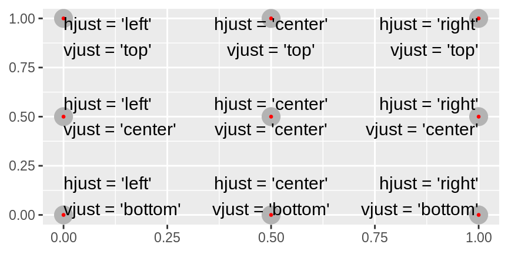

The tools covered in this post are important for communicating information to an audience that may not be as familiar with the data that you are working with.[^1] I'll first give a short overview of the most common functions used with graphs before diving into examples of each. 

**Resources:**
- [RStudio ggplot2 Cheat Sheet]({{ site.baseurl }}/pdf/r-cheat-sheet-data-visualization.pdf){:target="blank"}
- [Cookbook for R](http://www.cookbook-r.com/Graphs/){:target="blank"} has solutions to common problems.

[^1]: This post is meant for a person who is looking for a refresher on formatting ggplot2 plots. The content in this post is based on chapter twenty-eight of [R for Data Science](https://r4ds.had.co.nz/index.html) by Hadley Wickham & Garrett Grolemund.

#### Overview of Tools:

* Add labels with `labs(title = "...", subtitle = "...", caption = "...", x = "...", y = "...")`
* Add annotations with `geom_text()`, `geom_label`, or  `ggrepel::geom_label_repel`
* Add a reference line with `geom_hline(size = 2, color = white)` or `geom_vline()`
* Add a reference rectangle with `geom_rect()`
* Add a reference arrow with `geom_segment()` and the `arrow` argument
* Override or replace default scales with `scale_x_continuous()` or `scale_x_discrete`
* Change the legend position with `theme(legend.position = "...")`
* Change the legend display using `guides()` with `guide_legend()` or `guide_colorbar()`
* Customize color scales with `scale_color_brewer(palette = "...")` or `scale_color_manual(values = ...))`
* Zoom in on a region of the plot by setting `xlim` and `ylim` in `coord_cartesian()`
* Save plots with `ggsave()`, or with `knitr` in R Markdown

### Labels - Title, Caption, X, and Y Axes

Add labels with `labs()`:


# graph of fuel efficiency vs engine size with labels
ggplot(mpg, aes(displ, hwy)) +
  geom_point(aes(color = class)) +
  geom_smooth(se = FALSE) + 
  labs(
    title = "Fuel efficiency generally decreases with engine size",
    subtitle = "Two-seaters (sports cars) are exceptions because of their light weight",
    caption = "Data from fueleconomy.gov",
    x = "Engine displacement (L)",
    y = "Highway fuel economy (mpg)",
    color = "Car type"
  )




**Note:** it’s possible to use mathematical notation in your labels by
swapping out `""` for `quote()` (see `?plotmath` for details)

### Annotations - Writing information directly onto the plot

Add annotations with `ggrepel::geom_label_repel` to notate certain points on a plot using labels that are guaranteed not to overlap with each other:


# create data frame for labels
best_in_class <- mpg %>%
  group_by(class) %>%
  filter(row_number(desc(hwy)) == 1)

# graph with labels and make sure they're not touching each other; 
# also add point outlines for emphasis
ggplot(mpg, aes(displ, hwy)) +
  geom_point(aes(color = class)) +
  geom_point(size = 3, shape = 1, data = best_in_class) +
  ggrepel::geom_label_repel(aes(label = model), data = best_in_class)




Add a single label to the graph by manually specifying the label text and location in a data frame, and specifying text alignment with `vjust` and `hjust`:


# add a descriptive label to upper right
label <- mpg %>%
  summarise(
    displ = max(displ),
    hwy = max(hwy),
    label = "Increasing engine size is \nrelated to decreasing fuel economy."
  ) # another option is to use str_wrap() to automatically add line breaks

ggplot(mpg, aes(displ, hwy)) +
  geom_point() +
  geom_text(aes(label = label), data = label, vjust = "top", hjust = "right")




**Reference:** For label alignment with `hjust` and `vjust`, see below.

Additional annotation options include:

-   `geom_hline(size = 2, color = white)` and `geom_vline()` add reference lines
-   `geom_rect()` draws a rectangle around points of interest, with boundaries defined by aes: `xmin, xmax, ymin, ymax`
-   `geom_segment()` with `arrow` argument to draw an arrow, and define locations with aes: `x, y, xend, yend`

### Scales - Axis ticks and Legend Formatting

Scales are added by default for each mapping function, but you might
want to override defaults to tweak parameters such as the breaks on axes
or labels on the legend, or replace the scale altogether and use a
different algorithm.


# plot fuel efficiency vs engine size with edited labels
ggplot(mpg, aes(displ, hwy)) +
  geom_point() +
  scale_x_continuous(breaks = seq(0, 8, by = 2)) + # count labels by 2
  scale_y_continuous(labels = NULL) # suppress labels




If you want to only highlight exactly where observations occur, set the
breaks as a variable in the data. For example, the code and graph of U.S. presidents' serving terms below only displays the years signifying the start of a new presidential term. 


# plot the years that each U.S. president served in office
presidential %>%
  mutate(id = 33 + row_number()) %>%
  ggplot(aes(start, id)) +
    geom_point() +
    geom_segment(aes(xend = end, yend = id)) +
    scale_x_date(NULL, breaks = presidential$start, date_labels = "'%y")




Legends:

-   Change position of legend using `theme(legend.position = "...")`;
    options include `"left", "top", "bottom", "right", "none"`.
-   Change display of legend using `guides()` with `guide_legend()` or
    `guide_colorbar()`


# move legend to bottom and increase size of legend points
ggplot(mpg, aes(displ, hwy)) +
  geom_point(aes(colour = class)) +
  geom_smooth(se = FALSE) +
  theme(legend.position = "bottom") +
  guides(colour = guide_legend(nrow = 1, override.aes = list(size = 4)))




Customizing color scales:

-   `scale_color_brewer(palette = "Set1")` changes discrete colors to
    the [ColorBrewer scales](http://colorbrewer2.org/) for
    colorblindness.
-   `scale_color_manual(values = c(Republican = "red", Democratic = "blue"))`
    manually maps values and colors.
-   For continuous colors, use `scale_color_gradient()`,
    `scale_color_gradient_2()` (for a diverging scale),
    `scale_fill_gradient()`, or `scale_color_viridis()` (continuous
    analog to ColorBrewer scales).

### Zooming: A closer look at the data

To zoom in on a region of the plot, set `xlim` and `ylim` in the
`coord_cartesian()` function.


# zoom in on x values from 5 to 7 and y values from 10 to 30
ggplot(mpg, mapping = aes(displ, hwy)) +
  geom_point(aes(color = class)) +
  geom_smooth() +
  coord_cartesian(xlim = c(5, 7), ylim = c(10, 30))




Another useful tool is to match limits across multiple subplots using
the limits of the entire datset. This way, you can more easily compare
different subsets of the data.


# split car data into two parts: suv and compact cars
suv <- mpg %>% filter(class == "suv")
compact <- mpg %>% filter(class == "compact")

x_scale <- scale_x_continuous(limits = range(mpg$displ))
y_scale <- scale_y_continuous(limits = range(mpg$hwy))
col_scale <- scale_colour_discrete(limits = unique(mpg$drv))

# graph cars that are suvs
ggplot(suv, aes(displ, hwy, colour = drv)) +
  geom_point() +
  x_scale +
  y_scale +
  col_scale

# graph cars that are compact
ggplot(compact, aes(displ, hwy, colour = drv)) +
  geom_point() +
  x_scale +
  y_scale +
  col_scale




### Themes: Alter the look of the plot

Themes change the way that the non-data elements of your graph looks. R has 8 default themes, shown below, and more in add-on packages like [`ggthemes`](https://github.com/jrnold/ggthemes).

### Saving Plots

Save plots with `ggsave()`, or with `knitr` in R Markdown. In R Markdown, you can control figure sizing in the folowing ways:

-   Make plots a consistent width by setting `fig.width = 6` and
    `fig.asp = 0.618` (golden ratio) in defaults, and only adjusting
    `fig.asp` in individual chunks.
-   Specify output size with `out.width`. A nice default is
    `out.width = "70%"` and `fig.align = "center"`.
-   For multiple plots, set `out.width` and `fig.align = "default`. To
    ensure that font size is consistent, every time you adjust
    `out.width`, you also need to adjust `fig.width` to maintain the
    same ratio with the default `out.width`
-   To add captions, use `fig.cap`. This will also change the igure from
    inline to “floating”
-   If producing PDF output with very large plots, set
    `dev = "png"` to force using PNGs for speed and size.
-   The name of chunks is used to generate the file name of the graphic
    on disk.